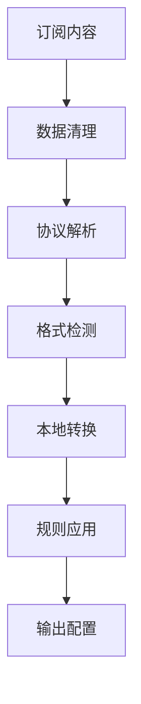

# 本地订阅转换器 (Local Subscription Converter)

## 概述

本项目已完全重构，**移除了对外部 subconverter 服务的依赖**，实现了完全本地化的订阅转换功能。基于 ACL4SSR 规则集，支持多种协议和输出格式。

## 🚀 主要特性

### ✅ 完全本地化

- **无外部依赖**：不再依赖第三方 subconverter 服务
- **高可用性**：避免外部服务限制和故障
- **快速响应**：本地处理，响应速度更快
- **隐私保护**：订阅数据不会发送到外部服务

### ✅ 多协议支持

- **VMESS**: V2Ray 协议
- **VLESS**: V2Ray 新协议
- **Trojan**: Trojan 协议
- **Shadowsocks**: SS 协议
- **Hysteria**: 新一代协议

### ✅ 多格式输出

- **Base64**: 原始 Base64 编码格式
- **Clash**: 基于 ACL4SSR 规则的 Clash 配置
- **Sing-box**: Sing-box JSON 配置
- **Surge**: Surge 配置文件
- **QuantumultX**: QuantumultX 配置
- **Loon**: Loon 配置文件

### ✅ 智能规则

- **基于 ACL4SSR**: 使用成熟的 ACL4SSR 规则集
- **自动分流**: 智能分流中国大陆和海外流量
- **广告拦截**: 内置广告和恶意网站拦截
- **服务优化**: 针对微软、苹果、谷歌等服务优化

## 🏗️ 架构设计

### 核心组件

```
src/lib/
├── converters/
│   ├── clash-config.ts      # Clash配置生成器
│   └── local-converter.ts   # 本地转换服务
├── parsers/
│   └── proxy-parser.ts      # 协议解析器
└── ...
```

### 转换流程



## 📝 代码重构亮点

### 1. 移除中文变量名

```typescript
// 旧代码 (中文变量)
let 订阅格式 = 'base64'
let 自建节点 = ''
let 订阅链接 = ''

// 新代码 (英文变量)
let subscriptionFormat: SupportedFormat = 'base64'
let selfBuiltNodes = ''
let subscriptionLinks = ''
```

### 2. 模块化设计

```typescript
// 协议解析器
export function parseVmess(vmessUrl: string): ParsedProxy | null
export function parseVless(vlessUrl: string): ParsedProxy | null
export function parseTrojan(trojanUrl: string): ParsedProxy | null

// 本地转换器
export class LocalConverter {
  static async convert(
    content: string,
    format: SupportedFormat
  ): Promise<string>
}
```

### 3. 类型安全

```typescript
export type SupportedFormat =
  | 'base64'
  | 'clash'
  | 'singbox'
  | 'surge'
  | 'quanx'
  | 'loon'

export interface ParsedProxy {
  protocol: string
  name: string
  server: string
  port: number
  [key: string]: any
}
```

## 🔧 配置说明

### ACL4SSR 规则组

- 🚀 节点选择
- ♻️ 自动选择
- 🌍 国外媒体
- 📲 电报信息
- Ⓜ️ 微软服务
- 🍎 苹果服务
- 📢 谷歌 FCM
- 🎯 全球直连
- 🛑 全球拦截
- 🍃 应用净化
- 🐟 漏网之鱼

### 支持的 URL 参数

- `?clash` - 强制 Clash 格式
- `?sb` 或 `?singbox` - 强制 Sing-box 格式
- `?surge` - 强制 Surge 格式
- `?quanx` - 强制 QuantumultX 格式
- `?loon` - 强制 Loon 格式
- `?b64` 或 `?base64` - 强制 Base64 格式

## 🚦 使用方法

### 1. 基本订阅

```
https://your-domain.com/your-token
```

### 2. 指定格式

```
https://your-domain.com/your-token?clash
https://your-domain.com/your-token?singbox
https://your-domain.com/your-token?surge
```

### 3. User-Agent 自动检测

系统会根据客户端 User-Agent 自动选择合适的格式：

- Clash 客户端 → Clash 格式
- Sing-box 客户端 → Sing-box 格式
- Surge 客户端 → Surge 格式
- 其他 → Base64 格式

## 🔍 调试功能

### 浏览器访问重定向已禁用

为了方便调试，现在浏览器访问不会自动重定向到编辑页面，可以直接查看转换结果。

### 详细日志

系统提供详细的转换日志，包括：

- 协议解析结果
- 格式检测过程
- 转换成功/失败信息
- 节点统计数据

## 🛠️ 开发说明

### 添加新协议支持

1. 在 `proxy-parser.ts` 中添加解析函数
2. 在 `local-converter.ts` 中添加转换逻辑
3. 更新类型定义

### 添加新输出格式

1. 在 `SupportedFormat` 类型中添加新格式
2. 在 `LocalConverter.convert()` 中添加处理逻辑
3. 实现格式特定的转换函数

## 📊 性能优势

| 特性     | 外部转换器    | 本地转换器    |
| -------- | ------------- | ------------- |
| 响应速度 | 慢 (网络延迟) | 快 (本地处理) |
| 可用性   | 依赖外部服务  | 100%可用      |
| 隐私性   | 数据外传      | 完全本地      |
| 自定义性 | 受限          | 完全可控      |
| 维护性   | 依赖第三方    | 自主维护      |

## 🎯 未来计划

- [ ] 支持更多协议 (Hysteria2, TUIC 等)
- [ ] 优化规则集更新机制
- [ ] 添加配置模板系统
- [ ] 实现订阅内容缓存
- [ ] 支持自定义规则集

---

**注意**: 本系统已完全移除外部 subconverter 依赖，所有转换均在本地完成，确保了高可用性和数据安全性。
